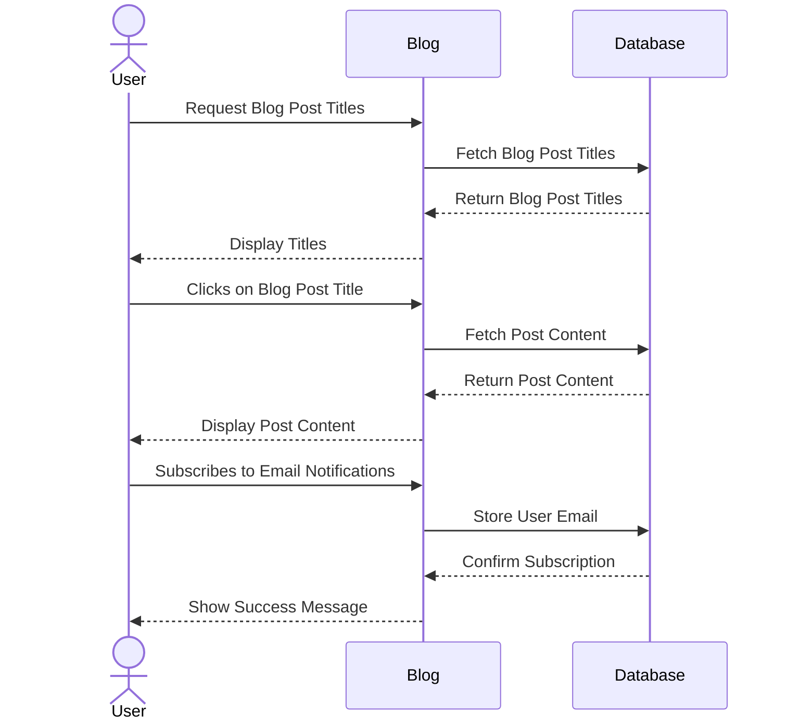

# Luke Richards Blog!

[My Notes](notes.md)

My application is a personal website!

## 🚀 Specification Deliverable

For this deliverable I did the following. I checked the box `[x]` and added a description for things I completed.

- [x] Proper use of Markdown
- [x] A concise and compelling elevator pitch
- [x] Description of key features
- [x] Description of how you will use each technology
- [x] One or more rough sketches of your application. Images must be embedded in this file using Markdown image references.

### Elevator pitch

For my startup I am going to make a personal blog.  This will have a clean, retro design, with the ability for users to view blog post titles and click on the one that entices them.  They will also have the ability to subscribe and get sent emails of the future blog posts.

### Design

The design will feature a clean, retro theme reminiscent of the early macintosh design.  In the selection menu, there will be rectangles with the titles inside, all lined up chronologically with the most recent post at the top.  At the bottom of the web page, after having scrolled through all of the posts, will be a a subscribe button.  When the user presses it, it queries for the user's email and displays a positive message once subscribed.

### Key features

- Select a blog post
- Blog page
- Subscribe button
- Little sparkle happens on the main site when someone subscribes

### Technologies

I am going to use the required technologies in the following ways.

- **HTML** - Structure the content of the web application, including blog post titles, articles, and interactive elements such as the subscribe button.
- **CSS** - Style the application with a clean, retro design, incorporating animations for visual feedback like sparkles and responsive layouts for different devices.
- **React** - Create a dynamic, component-based front-end to manage blog post rendering, user interactions, and real-time UI updates.
- **Service** - Handle backend logic, including API endpoints for fetching and managing blog posts, handling subscriptions, and sending email notifications.
- **DB/Login** - Store blog post data and manage user subscriptions securely. Authentication features could be added later if user login becomes necessary.
- **WebSocket** - Enable real-time communication for features like live post updates or displaying recent subscriber actions with minimal latency.
  

## 🚀 AWS deliverable

For this deliverable I did the following. I checked the box `[x]` and added a description for things I completed.

- [x] **Server deployed and accessible with custom domain name** - [My server link](https://lukedrichards.com).

## 🚀 HTML deliverable

For this deliverable I did the following. I checked the box `[x]` and added a description for things I completed.

- [x] **HTML pages** - I created 7 pages: index, about, login, post1, post2, resume, and subscribe.
- [x] **Proper HTML element usage** - I used classes, ids, types, headers, divs, spans, footers, and more.
- [x] **Links** - My pages link intuitively to each other
- [x] **Text** - I display text to guide and inform the user
- [x] **3rd party API placeholder** - I added a place holder for a weather icon in the upper right
- [x] **Images** - I added images of myself on my about page
- [x] **Login placeholder** - I added login placeholders
- [x] **DB data placeholder** - I added blog posts which will contain the string data in my database
- [x] **WebSocket placeholder** - I added a websocket placeholder on index.html which will light up when someone subscribes.

## 🚀 CSS deliverable

For this deliverable I did the following. I checked the box `[x]` and added a description for things I completed.

- [x] **Header, footer, and main content body** - I did not complete this part of the deliverable.
- [x] **Navigation elements** - I did not complete this part of the deliverable.
- [x] **Responsive to window resizing** - I did not complete this part of the deliverable.
- [x] **Application elements** - I created blog title buttons and blog post html pages
- [x] **Application text content** - I formatted text for the blog posts, including blockquotes.
- [x] **Application images** - I added images to the blog posts.

## 🚀 React part 1: Routing deliverable

For this deliverable I did the following. I checked the box `[x]` and added a description for things I completed.

- [x] **Bundled using Vite** - I bundled using Vite!
- [x] **Components** - I added many components, including post, blog, about, subscribe, and login
- [x] **Router** - I added routing to all of my components

## 🚀 React part 2: Reactivity

For this deliverable I did the following. I checked the box `[x]` and added a description for things I completed.

- [x] **All functionality implemented or mocked out** - I added functionality for a subscribe button popup and a dynamic weather icon.
- [x] **Hooks** - I implemented hooks for the popup state, as well as the state of fetching data from the weather api.

## 🚀 Service deliverable

For this deliverable I did the following. I checked the box `[x]` and added a description for things I completed.

- [x] **Node.js/Express HTTP service** - I added Node.js backend and login services
- [x] **Static middleware for frontend** - I used static middleware for frontend
- [x] **Calls to third party endpoints** - I call a weather endpoint
- [x] **Backend service endpoints** - I call the login, logout, and create endpoints
- [x] **Frontend calls service endpoints** - Clicking login calls the backend login endpoint, etc.

## 🚀 DB/Login deliverable

For this deliverable I did the following. I checked the box `[x]` and added a description for things I completed.

- [x] **User registration** - User can register
- [x] **User login and logout** - Users can login and logout
- [x] **Stores data in MongoDB** - Database stores blog posts.
- [x] **Stores credentials in MongoDB** - Database stores credentials.
- [x] **Restricts functionality based on authentication** - Special page is reserved for logged in users.  Ability to access the upload post UI is restricted to a single admin account.

## 🚀 WebSocket deliverable

For this deliverable I did the following. I checked the box `[x]` and added a description for things I completed.

- [ ] **Backend listens for WebSocket connection** - I did not complete this part of the deliverable.
- [ ] **Frontend makes WebSocket connection** - I did not complete this part of the deliverable.
- [ ] **Data sent over WebSocket connection** - I did not complete this part of the deliverable.
- [ ] **WebSocket data displayed** - I did not complete this part of the deliverable.
- [ ] **Application is fully functional** - I did not complete this part of the deliverable.
